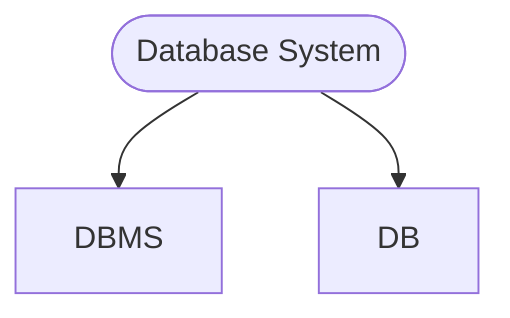
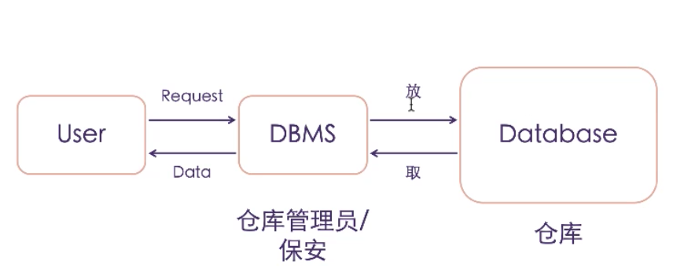

# Class Notes

## Resources

## Database_1 (`20/08/2023`)
<p align='center'></p>

### 什么是数据库?
- *储存`数据`的`仓库`*
- 可以检索数据
- 不同权限用户可以看不同的数据



<p align='center'></p>

#### 数据库组成
<p align='center'></p>

#### 什么是数据?
> 对客观事物, 事件进行记录并且可以被鉴别的符号
- 性质
- 状态
- 相互关系

车的数据: brand, model, model year, color, door, manufacturer, cost, color, engine, Automatic vs Manual

要避免人为拼写错误

#### 怎么存数据?
| 结构化存储 | 非结构化存储 |
| :---: | :---: |
| ***key*** | ***QR code*** |
| ***以表格形式存储*** | ***文件、图像、音频、视频等*** |

#### Database vs File system
| Database | File system |
| :---: | :---: |
| ***存储同一类数据*** | ***存储不同类型的数据*** |

#### 数据化结构
| Structure data | Semi-structure data | Unstructured Data |
| :---: | :---: | :---: |
| ***form, excel表格 (严格架构, 扁平存储)*** | ***json/xml/html, 具有一定结构性 + 灵活(可以嵌套, 存储metadata, 无序, 添加新元素方便)*** | ***Rich media,weather data, email, IoT, ML, AI (不能用二维逻辑整合)*** |

### Database Feature
- attribute
- entity
- value

#### Primary Key主键
- Unique
- NOT NULL

#### Foreign Key 外键
- 可以是null
- 一对多
- 其他表的主键

#### 关系型数据库 vs 非关系型数据库
- 关系型数据库: 数据一致性, 查询方便, 写入I/O较差, 无法处理复杂模型
- 非关系型数据库: 用文档形式存储 (xml,json), 先有数据再考虑schema, 灵活性高. ACID不如关系型数据库

`transaction一般是关系型`

##### ACID性质
Atomicity: 要么执行成功要么恢复原状
Consisency: 数据库完整性不被破坏 (符合预设规则)integrity constriant
Isolaion: 一件一件做和一起做是一样的
Durability: 失败的改动不影响原数据 (可以rollback)

### 安装mysql和DBeaver
#### mysql-mac
```shell
brew install mysql
brew services list
brew services start mysql
```

#### mysql-windows
[mysql](https://dev.mysql.com/downloads/installer/)
[DBeaver](https://dbeaver.io/download/)

Data Definition language(DDL): create job

```sql
-- 创建table
CREATE TABLE lab2.Cars (
    cid INT AUTO_INCREMENT PRIMARY KEY,
    brand VARCHAR(255),
    color VARCHAR(255),
    TYPE VARCHAR(255),
    price INT,
    year INT,
    sold VARCHAR(255)
);

-- 删除table
DROP TABLE lab2.Cars;

-- 修改table名(f2也行)
Alter TABLE lab2.Cars Rename TO Cars3

-- 添加一个Column
Alter Table Cars ADD COLUMN `工厂` VARCHAR(255)

-- 删除一个column
Alter Table Cars DROP COLUMN `工厂`

-- 插入数据
INSERT INTO
    Cars(`款式`, `品牌`, `颜色`, `类型`, `价格`, `生产年份`, `是否卖出`)
VALUES
    ('Camaro', '雪佛兰', '黄色', '肌肉车', 65000, 2018, '1'),
    ('911', '保驰捷', '红色', '跑车', 20000, 2017, ''),
    ('Escape', '福特', '蓝色', 'SUV', 60000, 2020, '0'),
    ('M3', '特斯拉', '红色', '轿车', 250000, 2018, ''),
    ('Carrera','Porsche','红色','sport car',240000,2013,''),
    ('Camaro', '雪佛兰', '红色', '肌肉车', 60000, 2016, '1'),
    ('Camaro', '雪佛兰', '黄色', '肌肉车', 65000, 2018, ''),
    ('Panamera', '保驰捷', '黑色', '跑车', 200000, 2017, '0'),
    ('Mustang', '福特', '蓝色', '肌肉车', 60000, 2020, ''),
    ('Model S', '特斯拉', '黑色', '轿车', 180000, 2018, '1'),
    ('Civic', 'Toyota', 'white', 'sedan', 25000, 2016, '0'),
    ('Camaro', '雪佛兰', '红色', '肌肉车', 60000, 2016, '0'),
    ('Challenger', '雪佛兰', 'Orange', '肌肉车', 70000, 2018, ''),
    ('911', '保驰捷', '红色', '跑车', 200000, 2017, '1'),
    ('Escape', '福特', '蓝色', 'SUV', 60000, 2020, ''),
    ('Model 3', '特斯拉', '红色', '轿车', 250000, 2018, '1'),
    ('Camaro', '雪佛兰', '红色', '肌肉车', 60000, 2016, '1'),
    ('120i', 'BMW', '白色', 'hatchpack', 40000, 2012, '');
```