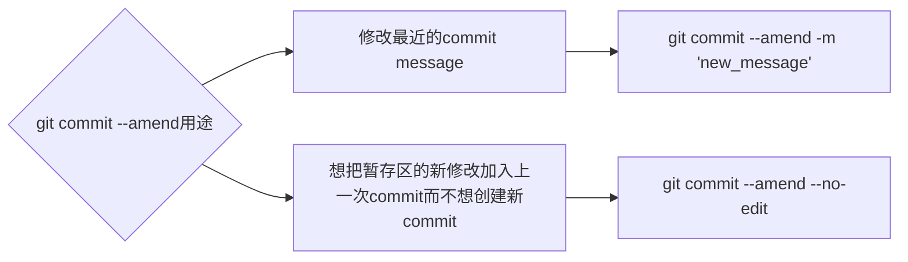

- [Class Notes](#class-notes)
  - [Resources](#resources)
  - [Git tutorial (`13/07/2023`)](#git-tutorial-13072023)
    - [常见git指令](#常见git指令)
      - [git clone和git pull的区别](#git-clone和git-pull的区别)
      - [merge的应用场景](#merge的应用场景)
      - [git rm和rm的区别](#git-rm和rm的区别)
    - [git rebase/git reset/git commit --amend的区别](#git-rebasegit-resetgit-commit---amend的区别)
      - [git reset --mixed/--soft/--hard](#git-reset---mixed--soft--hard)
      - [git rebase操作](#git-rebase操作)
      - [git commit --amend操作](#git-commit---amend操作)
    - [常见shell命令](#常见shell命令)
    - [cloud shell 练习](#cloud-shell-练习)
      - [environment setup](#environment-setup)

# Class Notes

## Resources
[Cloudshell Practice](https://console.cloud.google.com/cloudshell/editor?cloudshell_git_repo=https://github.com/praqma-training/git-katas.git)

## Git tutorial (`13/07/2023`)
<p align='center'></p>

### 常见git指令
- git init
- git clone
- git remote origin repo_link
- git branch 查看本地有哪些branch
- git branch -d/-D: 删除分支
- git switch 切换分支 (指针不会指到最上面)
- git checkout 切换分支 (指针到最上面)
- git add file_name: 将文件添加到staging area
- git commit -m "your commit message": 把暂存区的文件commit到本地repo
- git push origin main/master: 把本地repo的内容push到远程repo
- git log --oneline --graph: 当前分支commit的记录
- git status：查看git repo当前状态
- git diff： 对比本地文件变化
- git diff --staged: 对比staged(add之后)文件变化
- git restore --staged file: 把暂存区的文件放到工作区
- git restore --staged . 撤销暂存区所有文件
- git restore file: 撤销工作区修改
- git restore . 撤销工作区所有修改

#### git clone和git pull的区别
| git clone | git pull
| :---: | :---:
| ***第一次操作, 将远程repo下载到本地*** | ***本地repo已经和远程repo建立了联系, 基于远程仓库最新的内容, 更新本地repo***

#### merge的应用场景
`大多数merge都是用git官网上按钮完成, 一般create a pull request, 在别人review后, 才会执行merge`

> `git merge --squash <branch>`: 将所有commits应用到当前分支上, merge完删除分支, 节省对branch的维护成本

#### git rm和rm的区别
| git rm | rm
| :---: | :---:
| ***一般使用--cached来删除暂存区文件, 保留本地文件,可以恢复*** | ***Unix/Linux系统级别指令,很难恢复***

> 如果不小心在子文件夹使用git init. 可以cd后执行"rm -rf .git"来撤销这步git init操作同时保留子文件夹内容 (不用完全删除子文件夹).

<hr>

### git rebase/git reset/git commit --amend的区别
| git rebase | git reset | git commit --amend
| :---: | :---: | :---:
| ***合并commits, 让git log更简洁*** | ***撤销暂存区或commit的修改*** | ***修改最近一次commit***

#### git reset --mixed/--soft/--hard
- git reset --mixed 为默认，将commit的修改回退到工作区

```shell
git reset head^
git reset head^ 1.txt
git reset commit_id
git push origin branch
```

- git reset --soft: 将commit的修改回退到暂存区

```shell
git reset --soft head^
git reset --soft head^ 1.txt
git reset --soft commit_id
git push origin branch
```

- git reset --hard: 将工作区和暂存区修改全部丢弃

```shell
git reset --hard head^
git reset --hard head^ 1.txt
git reset --hard commit_id
git push origin branch --force-with-lease
```

#### git rebase操作
`丢弃rebase的修改`<br>
git rebase --abort

```shell
# 全局设置一个code editor
# 举例: git config --global core.editor "nano"
git rebase -i HEAD~2
window 1: 将除第一个pick的commit都改成s (不能先s后pick)
退出esc
window 2: 编辑commit msg (ctrl+k删除不需要的行)
退出esc
git push --force-with-lease
git pull --rebase
```

#### git commit --amend操作
> git commit --amend本质上创建一个新的commit代替了旧commit, commitid会变, ***建议不要amend public commits***



<hr>

### 常见shell命令
```shell
cd -> 切换到一个文件夹 # cd ..回退上一级
ls -> 列出当前目录所有文件
rm -> 删除文件 # rm -r 删除目录
open -> 打开一个文件夹 # open . 打开当前文件夹 | open .. 打开上一级文件夹
cp x newfile -> 拷贝文件到新位置(和mv不同, cp会保留原文件)
mkdir -> 新建目录
touch -> 新建文件
cat -> 输出文件内容
echo -> 打印/写入文件
# echo 'string' > filename  用string覆盖file所有内容<br>
# echo 'string' >> filename 把string添加到file内容最后
```

<hr>

### cloud shell 练习
<https://console.cloud.google.com/cloudshell/editor?cloudshell_git_repo=https://github.com/praqma-training/git-katas.git>

#### environment setup
```shell
cd basic-commits
source setup.sh
git config --global user.email "xxx"
git config --global user.name "xxx"
```