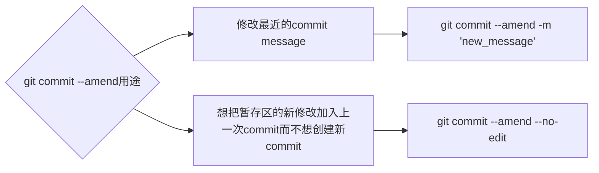

- [Class Notes](#class-notes)
  - [Resources](#resources)
  - [Git tutorial (`13/07/2023`)](#git-tutorial-13072023)
    - [常见git指令](#常见git指令)
      - [git clone和git pull的区别](#git-clone和git-pull的区别)
      - [merge的应用场景](#merge的应用场景)
        - [merge conflict](#merge-conflict)
      - [git rm和rm的区别](#git-rm和rm的区别)
    - [git rebase/git reset/git commit --amend的区别](#git-rebasegit-resetgit-commit---amend的区别)
      - [git reset --mixed/--soft/--hard](#git-reset---mixed--soft--hard)
      - [git rebase操作](#git-rebase操作)
      - [git commit --amend操作](#git-commit---amend操作)
    - [常规commit\&push(git add. \&\& git commit -m "msg" \&\& git push)](#常规commitpushgit-add--git-commit--m-msg--git-push)
    - [简便commit\&push(git commit -am "msg" \&\& git push)](#简便commitpushgit-commit--am-msg--git-push)
    - [gitpush和gitampush edge case handling (重点!)](#gitpush和gitampush-edge-case-handling-重点)
      - [Final Solution - gitpush \& gitampush](#final-solution---gitpush--gitampush)
    - [git commit -am的局限性和优势](#git-commit--am的局限性和优势)
      - [运行结果对比](#运行结果对比)
    - [.gitignore的陷阱](#gitignore的陷阱)
    - [如何将main分支所有commits合并成一个 (只在个人练习项目且只有一个分支时使用)?](#如何将main分支所有commits合并成一个-只在个人练习项目且只有一个分支时使用)
      - [gitclearMainHistory()函数](#gitclearmainhistory函数)
    - [如何将pull request中的commits合并成一个](#如何将pull-request中的commits合并成一个)
      - [gitclearPullHistory()函数](#gitclearpullhistory函数)
    - [删除本地分支和远程分支的细节](#删除本地分支和远程分支的细节)
      - [删除本地分支](#删除本地分支)
      - [删除远程分支](#删除远程分支)
        - [本地repo和远程repo的远程分支数量不一致](#本地repo和远程repo的远程分支数量不一致)
    - [常见shell命令](#常见shell命令)
    - [cloud shell 练习](#cloud-shell-练习)
      - [environment setup](#environment-setup)

# Class Notes

## Resources
[Git指南](./git.pdf)<br>
[Git常用命令行简写](https://juejin.cn/post/7155671438916059173)<br>
[Cloudshell Practice](https://console.cloud.google.com/cloudshell/editor?cloudshell_git_repo=https://github.com/praqma-training/git-katas.git)

## Git tutorial (`13/07/2023`)
<p align='center'></p>

### 常见git指令
- git init: 创建一个新repo
- git clone: 复制一个已存在的repo
- git remote add origin <remote_url>: 添加一个远程repo, 并命名为origin.
- git branch 查看本地有哪些branch
- git branch -d/-D: 删除branch
- git switch 切换branch (指针不会指到最上面)
- git checkout 切换branch (指针到最上面)
- git add file_name: 将文件添加到staging area
- git commit -m "your commit message": 把staging area的文件commit到本地repo
- git push origin main/master: 把本地repo的内容push到远程repo
- git log --all --decorate --oneline --graph: 查看当前分支commit的记录
- git status：查看git repo当前状态
- git diff： 比较working area和staging area的差异
- git diff --staged: 比较staging area和上一次提交的差异
- git restore --staged file: 把staging area的文件放到working area
- git restore --staged . 撤销staging area所有文件
- git restore file: 撤销working area修改
- git restore . 撤销working area所有修改

#### git clone和git pull的区别
| git clone | git pull
| :---: | :---:
| ***第一次操作, 将远程repo下载到本地*** | ***本地repo已经和远程repo建立了联系, 基于远程仓库最新的内容, 更新本地repo***

#### merge的应用场景
`大多数merge都是用git官网上按钮完成, 一般create a pull request, 在别人review后, 才会执行merge`

> `git merge --squash <branch>`: 将所有commits应用到当前分支上, merge完删除分支, 节省对branch的维护成本

##### merge conflict
> 别的组员将自己的修改merge到main分支, 这样你的feature分支会behind main分支, 当你执行git pull origin main时就会出现conflict

- 一般根据公司要求设置git config
```zsh
git config pull.rebase false # merge
git config pull.rebase true # rebase
```

- 再处理conflict
```zsh
git pull origin main # accept both
gitpush "msg"
```

#### git rm和rm的区别
| git rm | rm
| :---: | :---:
| ***一般使用--cached来删除暂存区文件, 保留本地文件,可以恢复*** | ***Unix/Linux系统级别指令,很难恢复***

> 如果不小心在子文件夹使用git init. 可以cd后执行"rm -rf .git"来撤销这步git init操作同时保留子文件夹内容 (不用完全删除子文件夹).

<hr>

### git rebase/git reset/git commit --amend的区别
| git rebase | git reset | git commit --amend
| :---: | :---: | :---:
| ***合并commits, 让git log更简洁*** | ***撤销暂存区或commit的修改*** | ***修改最近一次commit***

#### git reset --mixed/--soft/--hard
- git reset --mixed 为默认，将commit的修改回退到工作区

```shell
git reset head^
git reset head^ 1.txt
git reset commit_id
git push origin branch
```

- git reset --soft: 将commit的修改回退到暂存区

```shell
git reset --soft head^
git reset --soft head^ 1.txt
git reset --soft commit_id
git push origin branch
```

- git reset --hard: 将工作区和暂存区修改全部丢弃

```shell
git reset --hard head^
git reset --hard head^ 1.txt
git reset --hard commit_id
git push origin branch --force-with-lease
```

#### git rebase操作
`丢弃rebase的修改`
```bash
git rebase --abort
```

`查看commit的数量`
```bash
git log --oneline | wc -l
```

```shell
# 全局设置一个code editor
# 举例: git config --global core.editor "nano"
git rebase -i HEAD~2
window 1: 将除第一个pick的commit都改成s (不能先s后pick)
退出esc
window 2: 编辑commit msg (ctrl+k删除不需要的行)
退出esc
git push --force-with-lease
git pull --rebase
```

#### git commit --amend操作
> git commit --amend本质上创建一个新的commit代替了旧commit, commitid会变, ***建议不要amend public commits***



### 常规commit&push(git add. && git commit -m "msg" && git push)
*无论本地repo的所有文件是不是tracked, 保险的方式是使用git add .将工作区所有修改添加到暂存区, 全部的指令如下*
```bash
git add. && git commit -m "msg" && git push
```

`如果觉得上面的代码很长, 可以在~/.bash_profile中添加一个方法`

```bash
gitpush() {
    git add . && git commit -m "$1" && git push
}
```

这样一来, 你可以在terminal中使下面的指令实现相同效果
```bash
gitpush "commit_msg"
```

### 简便commit&push(git commit -am "msg" && git push)
*当本地repo里所有的文件都是已tracked, 使用下面指令可以完成git add, git commit和git push.*

```bash
git commit -am "your_msg" && git push
```
>但如果本地repo有的文件是些是untracked (新创建的), 要使用git add ., git commit和git push而不使用上面的代码

`如果觉得上面的代码很长, 可以在~/.bash_profile中添加一个方法`
```bash
gitampush() {
    git commit -am "$1" && git push
}
```

*这样一来, 你可以在terminal中使下面的指令实现相同效果*
```bash
gitampush "commit_msg"
```

### [gitpush](#常规commitpushgit-add--git-commit--m-msg--git-push)和[gitampush](#简便commitpushgit-commit--am-msg--git-push) edge case handling (重点!)
> 上面的gitpush和gitampush没有处理一个edge case. 在做pull request时, 需要创建一个新分支, 当第一次push到新分支时, 我们会因为没有写`-u`而出现error.

#### Final Solution - gitpush & gitampush
```bash
git_push() {
    [ -z "$(git branch -vv --list $(git symbolic-ref --short HEAD) | grep '\[.*\]')" ] \
        && git push -u origin $(git symbolic-ref --short HEAD) \
        || git push
}

gitpush() {
    git add . && git commit -m "$1"
    git_push
}

gitampush() {
    git commit -am "$1"
    git_push
}
```

*通过封装一个方法来判断是否本地repo和远程repo已经建立连接*

### git commit -am的局限性和优势
> 很多时候, 两种方法进行对比, 往往各有千秋. 绝对的情况很少. 一般称为trade-off. 前面两种git commit & git push的对比如下.

| | git add. && git commit | git commit -am |
| :---: | :---: | :---: |
| ***优点*** | ***保险, 可以正确将untracked修改(如新建文件)添加到staging area*** | ***时间和cpu消耗较少*** |
| ***缺点*** | ***时间和cpu消耗较多*** | ***无法将untracked修改(如新建文件)添加到staging area*** |

#### 运行结果对比
<div style='display:flex; justify-content: space-between'>
    
    
</div>

### .gitignore的陷阱
*很多时候第一次push时创建的.gitignore会生效. 但为什么push几次后再修改.gitignore就不生效了呢?*
> 实际上, .gitignore只能应用于未被track的文件. 如果这些文件已经被push过了, 我们需要执行下面的代码:

```bash
git rm -r --cached . # 从暂存区中取消跟踪所有文件和目录，但保留这些文件在工作目录中
git add . # 将工作区所有修改添加到暂存区
git commit -m 'update .gitignore' # 将暂存区修改commit到本地仓库
git push # 将本地仓库的commit推送到远程仓库
```

`如果觉得上面需要一行一行输入太麻烦, 可以在~/.bash_profile中添加alias (注意等号前后均无空格)`
```bash
alias gitignore-update='git rm -r --cached . && git add . && git commit -m "update .gitignore" && git push'
```

### 如何将main分支所有commits合并成一个 (只在个人练习项目且只有一个分支时使用)?
> ***很多人想到的是rebase方法. 但是这样做至少会剩余两个commits. 理想的方式是新建一个branch, 复制原来的branch, 删除原来的branch, 新branch重命名 (过河拆桥)***

```bash
git checkout --orphan new
git add .
git commit -m "first commit"
git branch -D main
git branch -m main
git push --force-with-lease -u origin main
```

*每次要手打6行, 能不能只打一行实现?*

#### gitclearMainHistory()函数
```bash
gitclearMainHistory() {
    if [ $(( $(git branch | wc -l) )) -ne 1 ] || [ $(( $(git ls-remote --exit-code --heads | wc -l) )) -ne 1 ]; then
       echo "Error: This command is intended for use with a single 'main' branch in a solo project.
Please ensure you are in the correct project context.
If you are working on a team project, consult with your team members before proceeding.
Function terminated."
       return 1
    fi
    git checkout --orphan new && \
    git add . && \
    git commit -m "$1" && \
    git branch -D main && \
    git branch -m main && \
    git push --force-with-lease -u origin main
}
```

`使用方法`
```bash
gitclearMainHistory "first commit"
```

### 如何将pull request中的commits合并成一个
> ***团队项目中, 一般有一个main branch和很多的feature branches. 有时候reviewer提了很多建议或有新功能需要在这个pull request中完成, 这都会导致pull request所绑定分支的commit数量过多. 有没有一种简单的方法可以将这个绑定分支的commit数量合并成一个, 同时不关闭这个pull request, 不影响别的feature branches和main branch?***

#### gitclearPullHistory()函数
```bash
gitclearPullHistory() {
    git rev-parse --verify "$1" &>/dev/null || {
        echo "Local branch $1 does not exist."
        return 1
    }
    git ls-remote --exit-code --heads origin "$1" &>/dev/null || {
        echo "Remote branch $1 does not exist."
        return 1
    }
    git merge-base --is-ancestor origin/main origin/"$1" &>/dev/null || {
        echo "Conflict detected between $1 and main branch."
        return 1
    }
    git checkout main && \
    git checkout -b new && \
    git merge --squash "$1" && \
    git add . && \
    git commit -m "merge squash" && \
    git push -u origin new && \
    git checkout "$1" && \
    git reset --soft new && \
    git push --force-with-lease -u origin "$1" && \
    git push origin --delete new && \
    git branch -d new
}
```

`使用方法`
```bash
gitclearPullHistory "Your_PR_branch_name"
```

<hr>

### 删除本地分支和远程分支的细节
> 分支是指向提交的指针

#### 删除本地分支
```zsh
git checkout main
git branch -d featureA
```

> 注意要切换到b分支才能删除a分支, 如果你checkout在a分支, 无法删除a分支

> 如果待删除分支有一个新commit, -d标志将失效. 这是一种保护机制

```zsh
git checkout main
git branch -D featureA
```

*强制删除本地分支, 不考虑其合并状态.*

#### 删除远程分支
```zsh
git push origin -d remote_branch_name
```

##### 本地repo和远程repo的远程分支数量不一致
> 在github界面上点击按钮删除了一个branch并不会使本地远程列表的分支数量同步, 需要执行下面的代码

```zsh
git fetch -p origin
```

### 常见shell命令
```shell
cd -> 切换到一个文件夹 # cd ..回退上一级
ls -> 列出当前目录所有文件
rm -> 删除文件 # rm -r 删除目录
open -> 打开一个文件夹 # open . 打开当前文件夹 | open .. 打开上一级文件夹
cp x newfile -> 拷贝文件到新位置(和mv不同, cp会保留原文件)
mkdir -> 新建目录
touch -> 新建文件
cat -> 输出文件内容
echo -> 打印/写入文件
# echo 'string' > filename  用string覆盖file所有内容<br>
# echo 'string' >> filename 把string添加到file内容最后
```

<hr>

### cloud shell 练习
<https://console.cloud.google.com/cloudshell/editor?cloudshell_git_repo=https://github.com/praqma-training/git-katas.git>

#### environment setup
```shell
cd basic-commits
source setup.sh
git config --global user.email "xxx"
git config --global user.name "xxx"
```