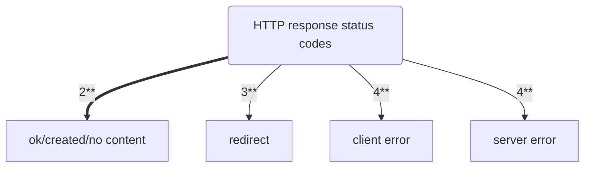

- [Class Notes](#class-notes)
  - [Resources](#resources)
  - [Node\_tutorial (`03/08/2023`)](#node_tutorial-03082023)
    - [复习](#复习)
      - [安装包](#安装包)
      - [运行包](#运行包)
      - [包版本2.3.4](#包版本234)
      - [http和fs模块](#http和fs模块)
        - [fs模块](#fs模块)
        - [http 模块](#http-模块)
      - [HTTP状态码与HTTP请求方法的关联](#http状态码与http请求方法的关联)
        - [200 OK](#200-ok)
        - [300 Multiple Choices:](#300-multiple-choices)
        - [404 Not Found:](#404-not-found)
        - [500 Internal Server Error:](#500-internal-server-error)

# Class Notes

## Resources
[课堂代码整理]("../Node_tutorial_code")

## Node_tutorial (`03/08/2023`)
<p align='center'></p>

### 复习
#### 安装包
```js
npm i package_name
npm i package_name --save-dev
```

#### 运行包
```js
npm run dev
npm run start
```

#### 包版本2.3.4
> 2: major changes<br>
> 3. minor changes<br>
> 4. patch changes<br>

#### http和fs模块
##### fs模块
```js
fs.readFile( filename, encoding, callback_function )
fs.writeFile( file, data, options, callback )
```

##### http 模块
```js
const http = require('http');
const server = http.createServer();
server.on("request", (req, res)=>{
    console.log("someone is visiting the server");
    res.end();
});
```

#### HTTP状态码与HTTP请求方法的关联


##### 200 OK
- ***200 GET、HEAD、POST、PUT、PATCH、DELETE 请求成功处理, 并返回请求的资源***
- ***201 Created：POST、PUT、PATCH 请求成功创建了新的资源, 并在响应的 Location 头中包含了新创建资源的URL***
- ***204 No Content：DELETE 请求成功处理, 但没有返回任何响应内容***

##### 300 Multiple Choices:
- ***301 Moved Permanently：永久性重定向, 表示请求的资源已永久移动到新位置***
- ***302 Found：临时性重定向, 表示请求的资源临时移动到新位置***
- ***304 Not Modified：条件请求，表示客户端缓存的资源未发生变化，可以继续使用缓存的版本***

##### 404 Not Found:
- ***400 Bad Request：客户端发送的请求有错误, 服务器无法处理***
- ***401 Unauthorized：需要身份验证, 表示客户端未提供有效的身份验证信息***
- ***403 Forbidden：服务器理解请求, 但拒绝执行，通常因为权限问题***
- ***404 Not Found：请求的资源未找到***

##### 500 Internal Server Error:
- ***500 Internal Server Error：服务器内部错误, 无法完成请求***
- ***502 Bad Gateway：服务器作为网关或代理, 从上游服务器收到无效的响应***
- ***503 Service Unavailable：服务器当前无法处理请求, 通常因为过载或维护***

