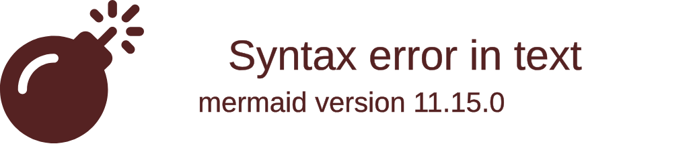

# Class Notes

## Resources
[Promise](https://developer.mozilla.org/en-US/docs/Web/JavaScript/Reference/Global_Objects/Promise)
[Messages_Board_Class_Solution](https://github.com/ESJiang/JR16-notes/tree/main/Messages_Board_Class_Solution)
[Message_Board_Solution_Two](https://github.com/ESJiang/JR16-notes/tree/main/Message_Board_Solution_Two)

## Node_tutorial (`17/08/2023`)
<p align='center'></p>

### 前端如何拿到后端数据?
#### Promise的三种情况
`当前端向后端发送请求, 后端会返回前端一个Promise`



*A promise is said to be settled if it is either fulfilled or rejected, but not pending.*<br>
```mermaid
flowchart LR
    A([Promise pending]) -- fulfill --> B[.then(onFulfillment) settled]
    B --> D[async actions]
    B -- return --> E[Promise(Pending)]
    E ==> F[.then().catch()]
    A -- reject --> C[.then(...,onRejection).catch(onRejection)]
    C --> G[error handling]
    C -- return --> E
```


### Message Board 前后端练习